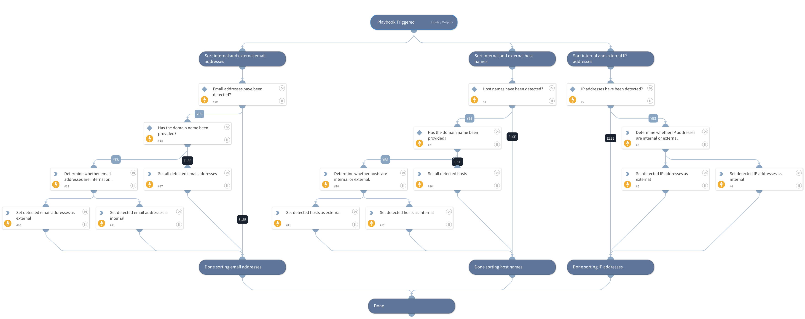

This playbook is used for sorting the results of threat hunting and detection playbooks. 

The playbook receives IPs, email addresses, and hosts provided manually or obtained by threat hunting and detection playbooks. The playbook then determines whether an object is internal or external by utilizing the internal domains, hosts regex, and internal IP ranges provided in the playbook inputs.

The output of the playbook facilitates pivoting searches for IP addresses, users, and hosts that may be affected.

## Dependencies
This playbook uses the following sub-playbooks, integrations, and scripts.

### Sub-playbooks
This playbook does not use any sub-playbooks.

### Integrations
This playbook does not use any integrations.

### Scripts
* IsEmailAddressInternal
* IsIPInRanges
* SetAndHandleEmpty
* IsInternalHostName

### Commands
This playbook does not use any commands.

## Playbook Inputs
---

| **Name** | **Description** | **Default Value** | **Required** |
| --- | --- | --- | --- |
| InternalRange | A list of internal IP ranges to check IP addresses against. The list should be provided in CIDR notation, separated by commas. An example of a list of ranges would be: "172.16.0.0/12,10.0.0.0/8,192.168.0.0/16" \(without quotes\). If a list is not provided, will use the default list provided in the IsIPInRanges script \(the known IPv4 private address ranges\). |  | Optional |
| InternalDomainName | The organizations internal domain name. This is provided for the script IsInternalHostName that checks if the detected host names are internal or external if the hosts contain the internal domains suffix. For example paloaltonetworks.com. If there is more than one domain, use the \| character to separate values such as \(paloaltonetworks.com\|test.com\). |  | Optional |
| InternalHostRegex | This is provided for the script IsInternalHostName that checks if the detected host names are internal or external if the hosts match the organization's naming convention. For example the host testpc1 will have the following regex \\w\{6\}\\d\{1\}. |  | Optional |
| DetectedIPs | A list of IP addresses that have been detected in threat hunting queries and playbooks.  |  | Optional |
| DetectedHosts | A list of hosts that have been detected in threat hunting queries and playbooks.  |  | Optional |
| DetectedEmails | A list of email addresses that have been detected in threat hunting queries and playbooks.  |  | Optional |

## Playbook Outputs
---

| **Path** | **Description** | **Type** |
| --- | --- | --- |
| HuntingResults.DetectedExternalEmails | External email addresses retrieved from threat hunting queries. | string |
| HuntingResults.DetectedInternalEmails | Internal email addresses retrieved from threat hunting queries. | string |
| HuntingResults.DetectedEmails | A list of all email addresses retrieved from threat hunting queries. Playbook output is generated only when the internal domain name is not specified in the playbook input. | string |
| HuntingResults.DetectedExternalHosts | External hosts retrieved from threat hunting queries. | string |
| HuntingResults.DetectedInternalHosts | Internal hosts retrieved from threat hunting queries. | string |
| HuntingResults.DetectedHosts | A list of all hosts retrieved from threat hunting queries. Playbook output is generated only when the internal domain name is not specified in the playbook input. | string |
| HuntingResults.DetectedExternalIPs | External IP addresses retrieved from threat hunting queries. | string |
| HuntingResults.DetectedInternalIPs | Internal IP addresses retrieved from threat hunting queries. | string |

## Playbook Image
---

