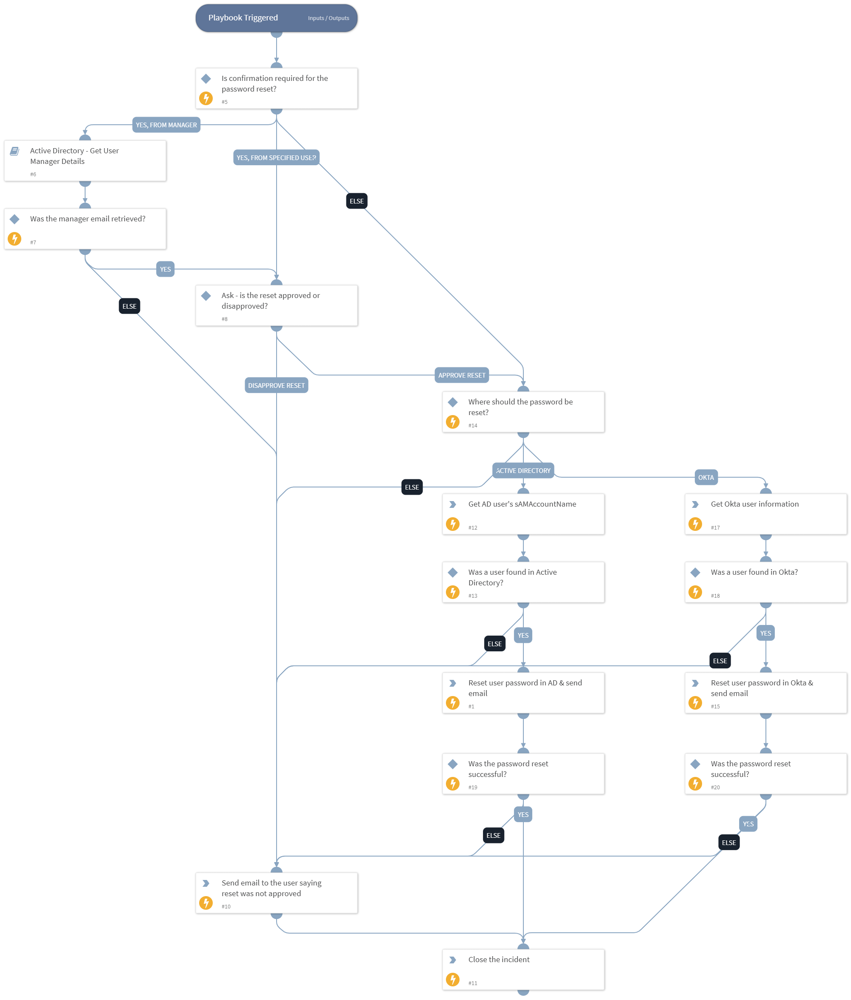

This playbooks should be triggered by a Slack or a Teams message from a user requesting to reset their forgotten password.
The playbook seeks approval before resetting the user's password. It then generates a new password for the user, meeting the complexity criteria defined in the playbook inputs, and sends an email to the user with the new password.
The only information required from the user requesting the password reset in this playbook is the "reporteremailaddress" field, which should hold the email address of the user asking for password reset.

## Dependencies
This playbook uses the following sub-playbooks, integrations, and scripts.

### Sub-playbooks
* Active Directory - Get User Manager Details

### Integrations
This playbook does not use any integrations.

### Scripts
* IAMInitADUser
* IAMInitOktaUser

### Commands
* send-mail
* okta-get-user
* closeInvestigation
* ad-get-user

## Playbook Inputs
---

| **Name** | **Description** | **Default Value** | **Required** |
| --- | --- | --- | --- |
| PasswordMaxDigits | The maximum number of digits in the generated password. If no value is specified, a value of 10 will be used. | 4 | Optional |
| PasswordMaxLowercase | Maximum number of lower case characters to include in password. If no value is specified, a value of 10 will be used. | 4 | Optional |
| PasswordMaxSymbols | Maximum number of symbols to include in password. If no value is specified, a value of 10 will be used. | 4 | Optional |
| PasswordMaxUppercase | Maximum number of upper case characters to include in password. If no value is specified, a value of 10 will be used. | 4 | Optional |
| PasswordMinDigits | Minimum number of digits to include in password. If no value is specified, a value of 0 will be used. | 2 | Optional |
| PasswordMinLowercase | Minimum number of lower case characters to include in password. If no value is specified, a value of 0 will be used. | 2 | Optional |
| PasswordMinSymbols | Minimum number of symbols to include in password. If no value is specified, a value of 0 will be used. | 2 | Optional |
| PasswordMinUppercase | Minimum number of upper case characters to include in password. If no value is specified, a value of 0 will be used. | 2 | Optional |
| UserEmailSubject | The subject of the email with the password that will be sent to the user. | User Password Reset | Optional |
| ConfirmationTarget | Determines who will confirm the password reset. Possible values are: left blank, email address of the user that will confirm the reset, or "Manager".  If no value is specified - confirmation will not be required when resetting the password.  If the value of "Manager" is specified - the user's manager email will be retrieved from Active Directory, and a confirmation email will be sent to the manager to allow or decline the password reset.  If an email is specified  - a confirmation email will be sent to the email specified to allow or decline the password reset. | ivandijk@paloaltonetworks.com | Optional |
| ConfirmationEmailSubject | Optional - applicable only if the "ConfirmationTarget" input is not blank. The subject of the email that will be sent to approve or disapprove the password reset. This email would be sent to the user's manager, IT staff or anyone else specified. | Action Required - User Password Reset | Optional |
| ConfirmationEmailBody | Optional - applicable only if the "ConfirmationTarget" input is not blank. The body of the email that will be sent to approve or disapprove the password reset. This email would be sent to the user's manager, IT staff or anyone else specified. | User [PLACEHOLDER] asked to reset their password. Please allow or decline the password reset. | Optional |
| TargetProduct | Determines whether the user password will be reset. Some organizations provision the data from Okta to Active Directory, so they may choose to reset the password in Okta instead of Active Directory. Possible values are \(choose one\): - Active Directory - Okta | Active Directory | Optional |

## Playbook Outputs
---
There are no outputs for this playbook.

## Playbook Image
---
